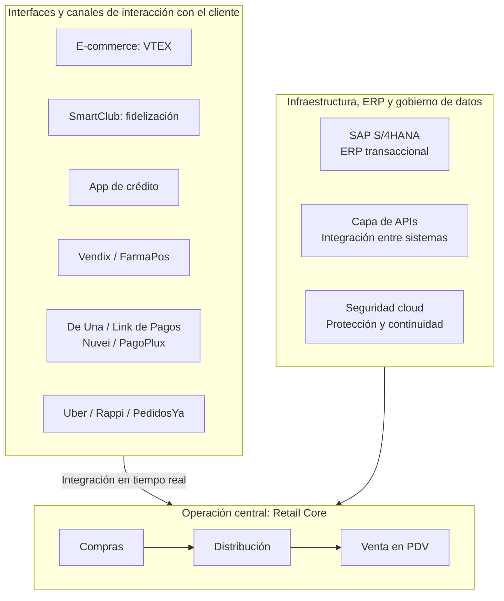
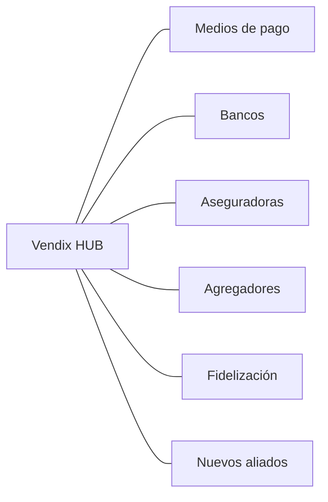
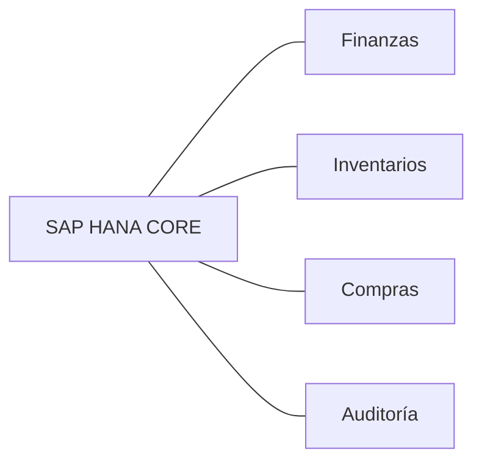
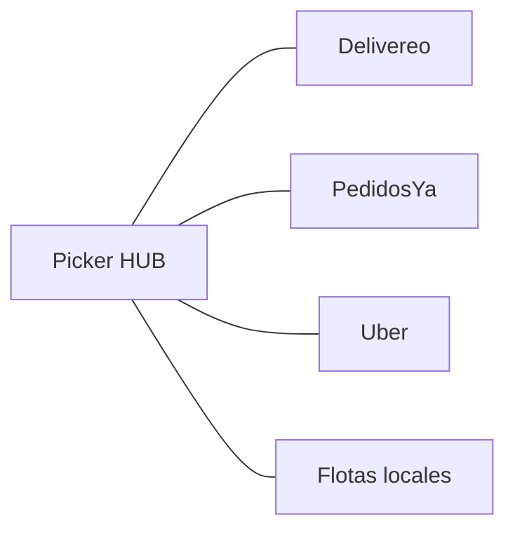
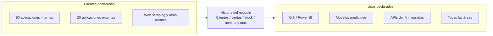

# Farmaenlace: sistemas y conexiones declarados en el PDF

Versión corregida: 8 de octubre de 2026.

Fuente única: «Hackaton - FARMAENLACE_BYD_Reto.pdf», proporcionado por el usuario. Este documento contiene exclusivamente sistemas, capacidades y relaciones que aparecen en la presentación. Cada vista mantiene el alcance de su lámina de origen.

## 1. Vista general del ecosistema — página 27

La presentación divide el ecosistema en interfaces y canales de interacción con el cliente, operación central e infraestructura/ERP/gobierno de datos.

**Interfaces y canales declarados:**

- E-commerce: VTEX.
- SmartClub: fidelización.
- App de crédito: crédito al cliente.
- Vendix/FarmaPos: más de 1.400 puntos de venta.
- Pasarelas de pago: De Una y Link de Pagos (Nuvei, PagoPlux).
- Agregadores: Uber, Rappi, PedidosYa y otros.

**Operación central (Retail Core):** compras → distribución → venta en PDV.

**Infraestructura, ERP y gobierno de datos:** SAP S/4HANA como ERP transaccional; capa de APIs para integración entre sistemas; seguridad cloud para protección y continuidad.

La lámina muestra integración en tiempo real de los canales con la operación central y el soporte de infraestructura a esa operación. No identifica llamadas individuales entre cada aplicación y cada componente de infraestructura.

Las flechas entre grupos reproducen la relación general de la lámina; no representan conexiones individuales entre los sistemas contenidos en esos grupos.

## 2. Vendix — página 29

La presentación muestra la evolución: FarmaPOS, caja de escritorio → Vendix Web, web y móvil → Vendix Conectado, ecosistema → Vendix Offline, continuidad.

El diagrama de Vendix HUB identifica estas conexiones:

La lámina declara que Vendix Offline permite continuar la venta ante fallas de conexión o energía y sincronizar al volver. No describe el mecanismo técnico que lo hace posible.

En este diagrama se conserva el término «Fidelización» de la lámina; no se sustituye por una conexión técnica específica con SmartClub.

## 3. Promociones y comercio electrónico — página 30

**PromoGo:** motor propio para calcular las promociones de los puntos de venta. Partner: Imbatec. La presentación declara propiedad del código y coherencia de precios en los locales.

**Pardux:** la lámina presenta «Antes: VTEX / Ahora: Pardux». Describe un e-commerce integrado a Farmaenlace, operación centralizada y automatizada, promociones a medida, zonificación inteligente y flexibilidad en formas de pago. Partner: Pardux.

La página 27 menciona VTEX y la página 30 presenta Pardux como el «ahora». Se conservan ambas referencias sin deducir qué plataformas siguen activas por marca ni el alcance de la migración.

Esta página no identifica las conexiones técnicas concretas de PromoGo o Pardux con Vendix, SAP o Picker.

## 4. SAP y última milla — página 31

**SAP HANA:** la presentación lo describe como columna vertebral del negocio para control financiero e inventarios en tiempo real. Su diagrama incluye finanzas, inventarios, compras y auditoría.

La página 27 utiliza el nombre SAP S/4HANA y la página 31 utiliza SAP HANA. Se mantienen los nombres y responsabilidades tal como aparecen, sin deducir su configuración técnica.

**Picker:** partner de última milla que selecciona operadores por cobertura y costo. Su diagrama muestra:

La presentación no identifica qué aplicación de Farmaenlace solicita los despachos a Picker.

## 5. Datos y analítica — páginas 28 y 29

La página 28 declara las siguientes fuentes:

- 80 aplicaciones internas: 90 % .NET y 10 % open source.
- 20 aplicaciones externas.
- Datos externos: web scraping y otras fuentes de información.

La plataforma almacena historia del negocio y declara 4,5 TB de datos activos. Incluye clientes, ventas, stock, nómina y otros dominios.

**Tecnologías enumeradas:** Ambari, ODP, Airflow, PySpark y StarRocks. Se mantienen como tecnologías declaradas, sin asignarles funciones técnicas adicionales.

**Usos declarados:** tableros e indicadores con Qlik Cloud, Sense, View y Power BI; modelos predictivos; APIs de IA integradas; información aportada y consultada por todas las áreas.

Este diagrama recoge el recorrido general presentado en la página 28. No identifica conectores, protocolos ni secuencias entre tecnologías.

La página 29 presenta el Repositorio Organizacional como una solución 100 % in-house, con historia comercial, consultas en segundos e información compartida entre gerencias.

Respecto al período histórico, la página 28 indica inicio en 2016 y la página 29 menciona 2017 al presente. Se conservan ambas referencias.

## 6. Infraestructura declarada — páginas 27 y 28

- Infraestructura híbrida: on-premise (Telefónica) + Google Cloud.
- 1.406 enlaces nacionales.
- Seguridad cloud: protección y continuidad.

El PDF no asigna cada aplicación a una ubicación concreta de infraestructura.

## 7. Fidelización y canales adicionales — páginas 13 y 17

**SmartClub, página 17:** programa de fidelización que incluye Medicity, Farmacias Económicas, Wellderma, Ambiente, Mascotas y BYD. Declara cashback, descuentos, activaciones temporales, productos seleccionados y alianzas.

La inclusión de BYD se registra como parte del programa presentado. No se dibujan conexiones con sistemas de BYD, porque no se identifican en el PDF.

**Farmacias Económicas, página 13:** se mencionan 1800, WhatsApp y chatbot como canales de atención. La lámina no detalla su conexión técnica con los demás sistemas.

## Fuente y referencias

Archivo: `/Users/juancarrillo/Downloads/1. Hackaton - FARMAENLACE_BYD_Reto.pdf`.

- Página 13: canales de Farmacias Económicas.
- Página 17: SmartClub.
- Página 27: ecosistema, operación central, ERP, APIs y seguridad.
- Página 28: fuentes de datos, tecnologías, usos e infraestructura híbrida.
- Página 29: Repositorio Organizacional y Vendix.
- Página 30: PromoGo y Pardux.
- Página 31: SAP HANA y Picker.
