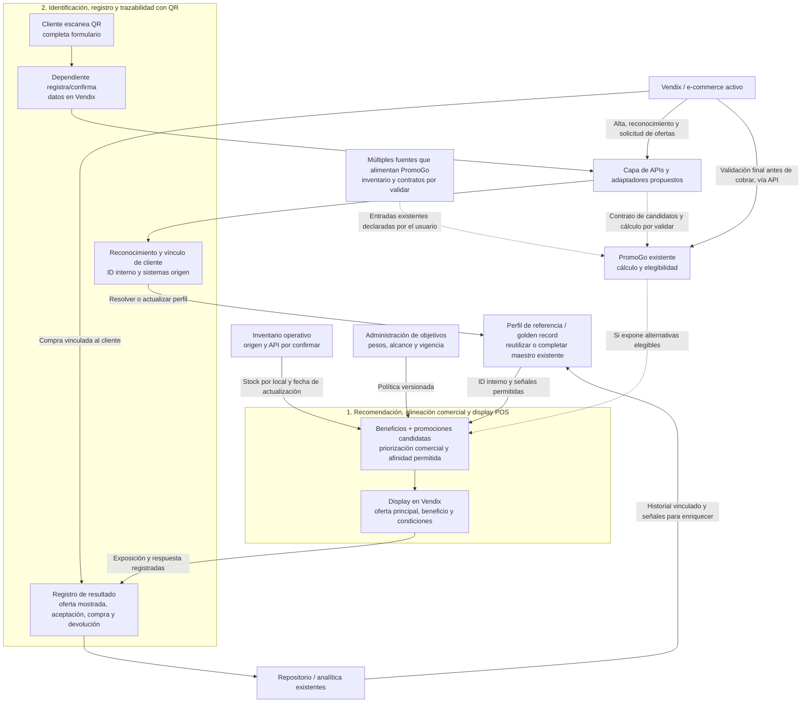

# Contexto que debe conservarse para próximas sesiones

Solicitud del usuario, 8 de octubre de 2026: recordar los siguientes problemas, solución inicial y beneficios; ayudar a conectar la solución con la arquitectura actual de Farmaenlace y contrastarla con Raia Drogasil, Walgreens Boots Alliance y Farmacias del Ahorro.

**Problemas declarados por el usuario:**

- Se pierde la trazabilidad del cliente cuando la venta se registra como «consumidor final»: no se identifica al usuario para seguir su relación con el negocio.
- Las promociones no se priorizan por necesidades del negocio, como agotar stock o introducir productos de temporada; según el usuario, todas salen con la misma prioridad.

Estos son antecedentes aportados por el usuario, pendientes de contrastar con datos operativos. La arquitectura disponible confirma un motor de cálculo de promociones, pero no documenta que PromoGo sea un recomendador ni su lógica de ordenamiento.

**Solución inicial del usuario:**

- Capturar datos mediante un formulario que requiera cédula y correo, para trazabilidad, promociones y recomendaciones personalizadas.
- Incorporar una capa de priorización de promociones adaptable de forma dinámica a requerimientos comerciales.
- Evaluar una capa después de PromoGo y una capacidad de seguimiento de usuarios, reutilizando la arquitectura actual.

**Beneficios esperados por el usuario:**

- Información de clientes para marketing, fidelización y otros objetivos de negocio.
- Promociones alineadas con parámetros comerciales y mejora del proceso de ventas.

Son objetivos por medir, no resultados ya obtenidos. No se han definido metas numéricas ni se ha autorizado o ejecutado una integración de producción.

## Organización funcional vigente: dos capacidades y un propósito compartido

En una tercera intervención del 8 de octubre de 2026, el usuario definió explícitamente las siguientes agrupaciones y añadió el registro mediante QR. Esta organización reemplaza la presentación anterior de los pasos como capacidades independientes; la secuencia de venta descrita más abajo sigue siendo aplicable.

**Corrección de alcance posterior del usuario:** excluir SmartClub de la solución. PromoGo se alimenta de múltiples fuentes, según lo aclarado por el usuario; no se limita a un programa de fidelización. La propuesta consume su contexto y resultados promocionales, sin introducir dependencia de una fuente particular. El inventario de entradas y contratos concretos de PromoGo sigue pendiente de validación. Esta corrección se aplica a ambas capacidades, al perfil de referencia y al diagrama; no modifica el documento original de sistemas declarados.

### 1. Motor de recomendación y alineación con negocio para promociones y display del POS

Agrupa:

- **Recuperar contexto promocional y beneficios aplicables:** consumir la información y resultados de PromoGo, que se alimenta de múltiples fuentes, y el contexto permitido del cliente desde su perfil de referencia. Esta consulta alimenta la recomendación; la identidad compartida se resuelve en la segunda capacidad.
- **Seleccionar la mejor oferta:** evaluar promociones compatibles con PromoGo usando carrito, stock local, temporada, objetivos comerciales y afinidad del cliente cuando exista información utilizable.
- **Mostrar la recomendación:** presentar en Vendix una oferta principal, beneficio, condiciones y motivo; permitir al dependiente ofrecerla o descartarla. Si no hay una opción adecuada, no forzar una sugerencia.

El display POS forma parte de esta capacidad funcional, implementado como adaptación de la interfaz de Vendix. PromoGo conserva las condiciones y el cálculo de promociones a partir de sus múltiples entradas; la nueva capa consume sus resultados y prioriza la presentación según contexto del cliente y objetivos de negocio.

### 2. Identificación, registro y trazabilidad del cliente, con alta por QR

Agrupa:

- **Identificar al cliente:** capturar cédula/correo mediante QR o dictado al dependiente. Reutilizar el perfil por documento y guardar el origen; caja recibe confirmación automáticamente, sin copiar códigos ni login.
- **Registrar el resultado:** objetivo de integración futura: asociar identidad con compra real, promoción, aceptación y devolución. El mock actual solo persiste identidad y sesión; no registra una venta real.
- **Registro mediante QR y fallback asistido:** cliente completa sus datos en el teléfono y recibe agradecimiento para continuar con el beneficio demo. Si dicta sus datos, el dependiente los ingresa en el mock de Vendix, con consentimiento opcional desmarcado.

**Flujo vigente corregido:** QR o datos dictados → servidor persiste perfil/registro → confirmación automática en caja → agradecimiento y beneficio de demostración → cierre de venta simulado local. Códigos internos permanecen por compatibilidad, sin exponerlos ni exigir su ingreso en la UI. No hay API real de Vendix o PromoGo.

**Diseño del MVP:** sesión de diez minutos; referencias opacas sin PII; capacidad privada de consola en cookie HttpOnly, sin cuentas ni login. El registro asistido exige esa capacidad de la caja y usa la misma transacción/HMAC del QR. Se conserva el primero confirmado ante concurrencia y no se sobrescriben datos canónicos ante discrepancias. No se consulta historial privado desde la consola.

El envío de un formulario no acredita por sí solo identidad ni autoriza mostrar un historial privado. Reutilizar el perfil que corresponda, resolver discrepancias y registrar las preferencias/autorizaciones requeridas para los usos previstos. Mantener la alternativa de alta asistida y la continuidad de la venta ante fallas, conforme al diseño acordado.

### Propósito común: alimentar el flujo de ventas y el perfil de usuario o golden record

Ambas capacidades participan en el mismo ciclo:

**Identificación/QR → perfil vinculado → beneficios y recomendación → display en Vendix → venta y resultado → enriquecimiento del perfil → próximas recomendaciones.**

El **golden record** se plantea como perfil unificado de referencia: ID interno estable, vínculos con identificadores de Vendix y otros canales del alcance, datos de contacto y su verificación, preferencias y referencias al historial de compras e interacciones. Mantener origen y actualización de los datos para resolver duplicados y discrepancias. Los eventos detallados pueden permanecer en el repositorio, asociados al perfil; enriquecerlo no exige copiar cada ticket como atributo ni reemplazar datos personales con cada evento.

La arquitectura disponible no confirma que exista hoy ese golden record ni qué sistema sea su autoridad. Revisar Vendix, el maestro de clientes si existe y el repositorio para reutilizar o completar esa capacidad. Estas son dos agrupaciones funcionales; no obligan a crear dos microservicios ni una nueva base de clientes.

### Corrección vigente: agradecimiento, fallback dictado y mock Vendix

El usuario pidió eliminar copiar/ingresar código para Vendix (mencionado oralmente como Bendix), agradecer al cliente y permitir continuar con un descuento. Añadió captura de cédula/correo dictados al dependiente. Se interpreta como simulación de atención/registro del cliente por el dependiente, sin onboarding ni login de staff.

Implementación actual en `apps/farmaenlace-qr`: dos entradas al mismo registro (QR/asistido), `registrationMethod: qr|assisted` y fuente `pos_qr|pos_assisted`. Identidad persiste en Firestore real configurado; pruebas en emulador. Mock usa dos productos con precios ficticios y 10% demo al confirmar servidor; agradecimiento en teléfono, estado en caja y cierre simulado local por pestaña. No genera venta, factura, cobro, evento de compra ni constancia de Vendix. El descuento no proviene de PromoGo ni es promoción vigente. Se mantiene sin auth y sin SmartClub. Datos dictados solo en memoria mientras se capturan; limpieza al guardar/cambiar/cancelar. Contratos reales de ventas/promociones/golden record pendientes.

Entrega publicada en main 87219a3, Vercel Ready dpl_6R8SFs4whMKsN6T7h6znx6mAyR9t y https://farma-copilot.vercel.app/pos. 24 casos correctos y QA escritorio/móvil. Work Item: `/work/farmaenlace-vendix-mock-20261008.md`. La evidencia de MVP inicial a continuación es histórica y fue sustituida en el comportamiento visible por esta corrección.

### Promociones exclusivas por registro

**Corrección de visibilidad vigente:** el usuario pidió que las ofertas solo aparezcan una vez que los datos estén guardados correctamente. Se oculta completamente el bloque de promociones, aviso y fila de descuento antes de registro confirmado, sin candados ni estado bloqueado visible. Tras QR/asistido se muestran aplicadas; al siguiente cliente vuelven a ocultarse. Entrega main d136166, Vercel Ready dpl_7FReGnkab5TosrJ7VRBQTjhaHhyD, alias público verificado sin ofertas antes de registrar; 3 E2E relevantes, lint/tipos/build correctos. Work Item `/work/farmaenlace-promociones-visibilidad-20261008.md`. La presentación bloqueada descrita a continuación corresponde a la versión anterior.

Corrección posterior del usuario: activar promociones únicamente a clientes registrados tras capturar sus datos. El mock muestra dos ofertas de demostración bloqueadas hasta registro confirmado (QR o dictado): 10% en gel limpiador y 10% en protector solar. Luego se aplican automáticamente por producto ($0,85 + $1,59), total demo $21,96. El estado y total derivan del mismo catálogo; no se acumula el descuento genérico anterior. Consentimiento de correos independiente y opcional. Cancelación/vencimiento/espera no habilitan ofertas; siguiente cliente vuelve a bloquearlas. Teléfono agradece, confirma activación y enumera las ofertas. No son campañas reales de PromoGo, no hay autorización de descuento real ni venta corporativa. Entrega main 975fcd5, Vercel Ready dpl_7FHE93qQfStUSBFsEjYfMfb25H14, alias público verificado. 13 pruebas pertinentes correctas (6 dominio y 7 E2E), lint/tipos/build correctos. Work Item `/work/farmaenlace-promociones-registrados-20261008.md`.

### Fase inicial: MVP QR sin auth/login y código para Vendix (histórico)

El usuario aprobó iniciar la segunda capacidad y lanzar un subagente con el mismo modelo/esfuerzo y contexto completo. Corrigió explícitamente el alcance: sin auth/login del tendero; cliente escanea QR, registra datos y el código se registra en Vendix. Subagente qr_mvp_builder lanzado con fork_turns all y sin overrides. React/Next.js, Firestore servidor y Vercel; Firebase Auth excluido.

MVP implementado en `apps/farmaenlace-qr`: Next.js/React/TypeScript preparado para Vercel, Firestore Admin exclusivamente servidor y actualizaciones SSE por la API Node.js. Consola abierta sin cuenta/login, aislada por capacidad opaca de navegador en cookie HttpOnly; presenta QR y código/estado sin PII. Cliente envía cédula/correo, se persiste perfil/registro y recibe código legible único. Tendero introduce ese código manualmente en Vendix; puede registrar constancia manual opcional. Sin monto/ticket obligatorio ni venta confirmada inventada; integración real pendiente de contrato/API. Firestore directo de cliente deny-all, sin autenticación anónima oculta. Validado con Emulator Suite y datos sintéticos, E2E de dos cajas/contextos y revisión manual en navegador; no desplegado en cloud.

Entrega local cerrada en [Work Item MVP QR](/work/farmaenlace-qr-mvp-20261008.md) y [OpenSpec archivado](../../openspec/changes/archive/2026-10-08-farmaenlace-qr-mvp-20261008/proposal.md). Aprobación explícita registrada para las specs revisadas sin auth. El flujo anterior con confirmación de datos por staff y Firebase Auth queda sustituido. 17 pruebas, lint, tipos y build correctos; conexión cloud diferida por el usuario.

Despliegue precisado por el usuario: Vercel usará el repositorio actual con despliegue automático; proporcionará Firebase después. Completar implementación y validación con emulador, dejar variables y configuración listas, sin crear/publicar proyectos manualmente. La conexión cloud se retoma cuando entregue Firebase.

La recarga del cliente conserva código sin guardar PII en el navegador; navegar a otro QR reinicia el formulario. La consola conserva la referencia de sesión ante fallos de red y permite reintentar. El perfil interno deduplica por cédula mediante índice HMAC y deja discrepancias de correo/preferencias pendientes sin sobrescritura pública. Es una base de referencia no verificada, todavía sin sincronización con el maestro corporativo. Guía de ejecución/configuración: `apps/farmaenlace-qr/README.md`; Root Directory de Vercel `apps/farmaenlace-qr`.

El usuario proporcionó Firebase real: proyecto `farma-copilot-2026`, nombre «Farma Copilot», RTDB `https://farma-copilot-2026-default-rtdb.firebaseio.com` y confirmó Firestore creado en `us-central1`. Se conserva Firestore; RTDB no se usa. Reportó reglas cloud temporalmente abiertas; las locales siguen deny-all. Configuración pública web recibida, sin credenciales Admin. El usuario configurará las credenciales privadas en Vercel; plantilla `.env.production.example` lista. REST sin auth a documento inexistente respondió 404, sin leer/escribir datos; backend cloud aún no verificado. [Seguimiento cloud](/work/farmaenlace-firebase-cloud-20261008.md).

## Dirección de producto precisada por el usuario

En una segunda intervención del 8 de octubre de 2026, el usuario indicó que quiere un modelo inspirado en: CPF y beneficios en mostrador de Raia Drogasil; identificación y Next-Best-Action de myWalgreens; y Monedero del Ahorro vinculado a compras recurrentes y canales digitales.

**Objetivo adoptado para la propuesta de Farmaenlace:** identificar al cliente de forma sencilla durante la compra, vincular historial y beneficios entre canales y mostrar al cajero una oferta prioritaria que combine relevancia para el cliente con objetivos de negocio. Este objetivo amplía el formulario inicial hacia una experiencia de venta asistida en Vendix.

El usuario también mencionó despachos desde tiendas y recompra programada como referentes. Se consideran posibilidades de evolución, sin asumir que haya solicitado implementar logística o compras automáticas en el primer alcance. Las cifras de sucursales aportadas se conservan como contexto de su mensaje y no se adoptan como cifras actuales verificadas.

## Experiencia objetivo en mostrador

1. **Reconocer:** el cliente facilita su cédula o una credencial vinculada al perfil, por definir. En el alta puede escanear un QR y completar cédula/correo; el dependiente registra/confirma esos datos en Vendix. En visitas posteriores se recupera el perfil existente. Una búsqueda por documento identifica un registro, pero no autentica por sí sola a la persona: consultar información privada o canjear beneficios requiere la verificación acordada.
2. **Vincular:** Vendix asocia la compra con el ID interno; se recuperan el contexto permitido del cliente y las promociones/beneficios aplicables a través de PromoGo y sus múltiples entradas, sujetos a sus reglas vigentes.
3. **Evaluar:** se obtienen candidatos compatibles con PromoGo y se priorizan usando el carrito, disponibilidad local, objetivo comercial y señales del cliente cuando corresponda.
4. **Asistir:** Vendix muestra una recomendación principal al cajero: producto/oferta, beneficio para el cliente, condición de activación y una explicación breve. El empleado puede ofrecerla o descartarla. Si ninguna oferta es adecuada, no se fuerza una recomendación.
5. **Cerrar y aprender:** PromoGo valida el precio final y las promociones aplicadas; la capacidad de trazabilidad registra exposición, aceptación, venta y devolución con los identificadores necesarios. El resultado enriquece el perfil/golden record mediante historial vinculado y señales permitidas para futuras decisiones en canales conectados.

Ejemplo hipotético con un producto de cuidado personal: Vendix muestra una promoción de protector solar válida en ese local, relevante para la temporada y con stock suficiente; la persona acepta, se recalcula el carrito y se vincula el ticket a su perfil. Una compra no permite inferir diagnóstico ni quién utilizará el producto.

**Nombre funcional propuesto:** identificación omnicanal y mejor oferta en caja. La selección inicial se limita a ofertas comerciales; un Next-Best-Action más amplio podría incorporar invitación a fidelización u otras acciones en una fase posterior.

**Qué conectar:** adaptar Vendix para alta/reconocimiento, recepción del registro QR y una recomendación visible; resolver la identidad en el maestro/perfil de referencia acordado; desarrollar o extender la priorización; consumir PromoGo y conservar sus múltiples fuentes como contexto de integración; vincular eventos con el repositorio y el perfil de referencia. No se requiere tokenizar pagos para el alcance inicial.

**Evolución logística opcional:** el despacho desde tiendas requeriría inventario reservable por local, selección de tienda, preparación, gestión de pedidos y despacho. La arquitectura declara Pardux, SAP y Picker, pero no confirma estos contratos ni su conexión entre sí. Identificar clientes no habilita automáticamente ship-from-store; se trataría como un alcance independiente.

## Estado de evidencia de las afirmaciones aportadas

- **RD: CPF en caja, confirmado.** Drogasil indica informar el CPF en mostrador o caja para identificar la compra y usar puntos como descuento, con código de autorización. Respalda el patrón de identificación y beneficios, no una regla universal de descuentos automáticos para cualquier compra. [Drogasil/Stix](https://www.drogasil.com.br/stix).
- **RD: «más del 90 % de compras identificadas», pendiente en esa formulación.** El informe de resultados de 2017, publicado el 22 de febrero de 2018, afirma que el programa de fidelización representaba el 93 % de los ingresos (página 3). Es una métrica de ingresos, no de cantidad de tickets identificados; no se sustituye una por otra ni se adopta como dato actual. [RD 2017](https://ri.rdsaude.com.br/Download.aspx?Arquivo=Ag3gW4jHi9bu3wHbXeJZIQ%3D%3D&linguagem=en).
- **RD: ship-from-store, confirmado históricamente.** El informe 1T2020, publicado el 28 de abril de 2020, registra 191 tiendas con despacho desde tienda en 46 ciudades al cierre de marzo y retiro en el 100 % de sus tiendas (página 2). No demuestra que identificar con CPF haya causado por sí solo ese despliegue. [RD 1T2020](https://ri.rdsaude.com.br/Download.aspx?Arquivo=leGt0ilHLyTaY5+x9ankOg%3D%3D&linguagem=en).
- **Walgreens: teléfono y perfil para beneficios, confirmado.** La página oficial describe teléfono, nombre y código postal para el alta; correo o dirección para redimir beneficios; identificación con teléfono al comprar. La fuente de myWalgreens ya citada describe ofertas personalizadas. [myWalgreens](https://www.walgreens.com/topic/promotion/mywalgreens.jsp).
- **Walgreens: tokenización como llave de identidad unificada y motor Next-Best-Action en pantallas de cajeros, no corroborados en las fuentes primarias revisadas.** Se conserva como referencia aportada por el usuario pendiente de fuente. La pantalla con una oferta principal sí es una propuesta propia válida para Farmaenlace, sin atribuir ese despliegue a Walgreens como hecho.
- **Farmacias del Ahorro: monedero y cuenta digital vinculados a beneficios, confirmado por las fuentes ya citadas.** La afirmación de recompra automática/programada basada en ese historial no quedó demostrada en las fuentes revisadas. Acumular beneficios por compras recurrentes y programar un pedido recurrente son capacidades diferentes; esta última sería evolución por validar.

# Base arquitectónica y límites de evidencia

Fuente interna: [arquitectura preliminar](../../../farmaenlace-arquitectura-preliminar.md). Describe los sistemas declarados en el PDF, no contratos de APIs ni una inspección de sistemas en funcionamiento.

- **Vendix/FarmaPos:** canal de venta y evolución con operación offline y sincronización al recuperar conexión. Punto candidato para identificación y presentación de ofertas; esas extensiones son propuestas.
- **PromoGo:** motor propio de cálculo de promociones en puntos de venta; propiedad del código declarada. El usuario aclara que recibe información de múltiples fuentes; sus conexiones específicas no están enumeradas en el documento base. No se conoce si devuelve todas las promociones elegibles, solo un resultado de cálculo, o si admite extensiones de prioridad.
- **Pardux:** e-commerce presentado como «ahora» en la página 30; VTEX también aparece en la vista general. Confirmar qué plataforma opera por marca antes de implementar conectores.
- **SAP S/4HANA / SAP HANA:** denominaciones de las láminas para capacidades transaccionales, financieras e inventarios. Confirmar origen, granularidad y disponibilidad de stock por local; no se deduce que exista una API con el contrato requerido.
- **Capa de APIs:** integración declarada. Candidata para publicar o adaptar contratos de identidad, promociones y eventos.
- **Repositorio Organizacional y plataforma de datos:** historia con clientes, ventas y stock, además de modelos predictivos y APIs de IA declarados. Reutilizar analítica existente cuando se conozcan disponibilidad y calidad; no asumir identidad unificada ni capacidad transaccional en tiempo real.
- **Infraestructura híbrida y ecosistema mayoritariamente .NET:** contexto para elegir un despliegue compatible. No basta para fijar hosting, base de datos, cola o framework.

No se conocen conexiones técnicas individuales entre PromoGo, Vendix, Pardux y SAP, ni el inventario completo de fuentes que alimentan PromoGo. Todo flujo siguiente representa arquitectura propuesta, no una conexión confirmada del PDF.

# Recomendación: reutilizar, adaptar y desarrollar

## Identidad y trazabilidad

**Revisar y reutilizar el maestro de clientes disponible, si existe.** Evitar una segunda base de clientes si ya existe un identificador confiable. Si falta resolución de identidad entre Vendix y los canales del alcance, desarrollar una capacidad de vinculación que mapee sus identificadores al perfil de referencia acordado.

**Adaptar Vendix y el e-commerce activo** para registrar o reconocer al cliente. El formulario solicitado exige cédula y correo en el alta; el QR permite completarlo desde el teléfono y que el dependiente registre/confirme los datos en Vendix. En compras posteriores, reutilizar una sesión autenticada o una credencial de fidelización vinculada. Como decisión de diseño propuesta, el alta no bloquea la venta de quien no participa: se mantiene una compra anónima con recomendaciones comerciales sin personalización. Esto debe validarse con el responsable del flujo comercial.

**Desarrollar o adaptar la asociación compra–cliente y los eventos.** Un formulario aislado no resuelve la trazabilidad: cada ticket/pedido debe conservar un `customer_id` interno cuando la identidad esté vinculada. Separar ese vínculo de la etiqueta fiscal «consumidor final», con el equipo responsable de facturación; no modificar reglas fiscales por inferencia.

Datos mínimos propuestos: identificador interno, documento protegido, correo, estado de verificación, referencias a sistemas origen y preferencias/autorizaciones por finalidad. Validar formato de documento no prueba identidad; verificar acceso al correo tampoco prueba titularidad de la cédula. Resolver duplicados y discrepancias con reglas explícitas, sin fusionar perfiles únicamente por correo compartido.

Mantener cédula y correo fuera del motor de ordenamiento y de logs analíticos generales. Usar el identificador interno para los eventos. Diferenciar registro, comunicación promocional y personalización en las preferencias. Empezar la personalización con categorías comerciales no sensibles; no inferir diagnósticos a partir de compras. Son recomendaciones de diseño, no un dictamen legal.

No atribuir retrospectivamente tickets anónimos a una persona sin evidencia verificable. El comprador puede adquirir productos para terceros: identidad comercial no equivale a identidad del paciente.

## Promociones

**Reutilizar PromoGo como autoridad de cálculo y condiciones promocionales.** La capa propuesta determina qué ofertas mostrar primero; no cambia por sí sola descuentos, acumulabilidad o precios cobrados.

**Preferir una capa separada de priorización con integración por API**, siempre que existan candidatos suficientes para ordenar. Permite compartir objetivos comerciales entre canales y cambiar configuración sin acoplarla al cálculo transaccional. No implica un microservicio independiente obligatorio: puede ser un módulo desplegable con la plataforma actual.

**Adaptar PromoGo solo si hace falta un punto de extensión o exposición de candidatos.** Si ya tiene reglas de prioridad que satisfacen el objetivo y pueden reutilizarse en los canales requeridos, configurarlas o extenderlas antes de construir una capacidad duplicada. La decisión definitiva depende de esa revisión.

**Desarrollar la capacidad faltante:** políticas comerciales versionadas, filtros, ordenamiento explicable, un mecanismo de administración y registro de resultados. Empezar por reglas y pesos configurables; añadir modelos de afinidad cuando haya datos y evaluación que lo justifiquen. Un LLM no es requisito para resolver ninguno de los dos problemas.

# Flujo propuesto de integración

Todos los enlaces del diagrama son propuestas. Las líneas discontinuas destacan dependencias críticas todavía sin contrato confirmado; las líneas continuas tampoco certifican integraciones actuales. Las flechas a componentes existentes son lógicas y pueden pasar por la capa de APIs.

Secuencia recomendada:

1. El canal reconoce al cliente o conserva una sesión anónima y envía local, canal y contexto de compra.
2. Se obtienen promociones candidatas y su elegibilidad. **Solo puede ubicarse literalmente después de PromoGo si su salida incluye alternativas útiles para ordenar.** Si devuelve únicamente el descuento ganador, se requiere un adaptador o extensión que suministre candidatos y use PromoGo para validarlos; ordenar una única salida no resuelve el problema.
3. Se filtra por vigencia, local, canal, disponibilidad suficiente y condiciones comerciales. Se consideran también las condiciones de activación, para no confundir una oferta que exige agregar un producto con un descuento ya aplicable al carrito actual.
4. Se aplica la política comercial activa y, si corresponde, afinidad del cliente; se devuelven las mejores opciones con una explicación breve.
5. Al elegir una oferta y cerrar la venta, PromoGo vuelve a validar condiciones y cálculo sobre el carrito actualizado. Ordenar ofertas no equivale a decidir qué combinaciones de descuentos se cobran.
6. Se registra qué se mostró realmente, qué se aceptó y qué se compró, con versión de política e identificadores de decisión y transacción. No contar una respuesta de API como impresión si no fue visible.

# Priorización dinámica que responde al negocio

Primero aplicar restricciones obligatorias: oferta válida, producto disponible en ese local, cantidad suficiente, elegibilidad y límites comerciales acordados. Una prioridad alta no vuelve válida una oferta inválida.

Después, una regla inicial podría combinar señales normalizadas:

`prioridad = w_stock × exceso_local + w_temporada × relevancia_temporal + w_campaña × prioridad_comercial + w_afinidad × afinidad_cliente`

Es una fórmula ilustrativa; las señales, pesos y reglas se deben definir con negocio. No hay pesos calibrados ni rendimiento demostrado. Para personas sin historial, omitir afinidad y ajustar la ponderación de las señales disponibles.

El margen puede ser un umbral obligatorio y, si negocio lo requiere y existen datos, una señal adicional. El exceso de stock debe calcularse respecto de demanda o cobertura objetivo por local, no solo por unidades absolutas en toda la cadena.

Ejemplo hipotético: una campaña de temporada puede mostrarse primero en un local con demanda y stock adecuados; una campaña de liquidación puede dominar en otro local con exceso del producto participante. Si se agota, se excluye aunque el objetivo comercial siga activo. El sistema prioriza promociones autorizadas; crear una promoción nueva exige el proceso de configuración de PromoGo.

La administración debe permitir seleccionar objetivo, productos/categorías, locales, canal, fechas, prioridad o pesos, restricciones y responsable. Versionar, activar, pausar y revertir políticas con auditoría. Definir precedencia cuando coinciden campañas. «Dinámico» significa cambiar la política y su vigencia sin modificar código para cada campaña; no requiere aprendizaje automático.

# Continuidad y datos

- Conservar la capacidad offline de Vendix. Ante falla de identidad o ranking, continuar la venta con el comportamiento promocional que Vendix soporte y una alternativa comercial aprobada, sin inventar descuentos.
- Establecer tiempo máximo de respuesta y vigencia de stock/configuración. Si están desactualizados, retirar recomendaciones que dependan de ellos o usar una alternativa acordada; no asumir que SAP será consultado por cada oferta.
- Sincronizar eventos pendientes con identificadores idempotentes para evitar duplicar compras o conversiones al volver la conexión. Usar el mecanismo existente si cumple; agregar uno solo si falta.
- Preferir señales precalculadas del repositorio para afinidad y cobertura histórica, con actualización operativa separada para disponibilidad. Confirmar latencia antes de elegir batch, eventos o consulta directa.
- Registrar como mínimo `event_id`, `occurred_at`, `customer_id` opcional, canal/local, ticket/pedido, promoción, decisión y versión de política; registrar exposición/aceptación y compra/devolución como eventos distintos. Asociar una compra a una recomendación solo con una relación verificable.

# Referentes farmacéuticos y aplicación a Farmaenlace

Fuentes primarias consultadas el 8 de octubre de 2026. Estos casos acreditan capacidades públicas; no demuestran por sí solos un algoritmo equivalente de optimización por stock ni una mejora causal de ingresos.

## Raia Drogasil / RD Saúde

La página oficial de **Programa Mais Saúde** describe cupones y ofertas personalizadas disponibles en la app de Raia o en el mostrador. La página de **Stix** confirma el programa compartido de relación con clientes de Droga Raia y Drogasil y beneficios como ofertas personalizadas, puntos y servicios. [Programa Mais Saúde](https://www.drogaraia.com.br/programamaissaude), [Stix](https://www.drogaraia.com.br/stix).

Aplicación propuesta: vincular el reconocimiento del cliente con promociones y beneficios aplicables, y entregar ofertas coherentes en canales digitales y mostrador. No es evidencia de que RD utilice el ordenamiento comercial específico propuesto aquí. No se atribuyen cifras de crecimiento a estas capacidades sin evaluación publicada que lo sustente.

## Walgreens Boots Alliance: prácticas de Walgreens y Boots

Walgreens documentó **myWalgreens** como una plataforma con ofertas digitales personalizadas, preferencias de cuenta, recibos digitales y una credencial de compra en código de barras. Describe ofertas basadas en hábitos individuales. Es un antecedente histórico del lanzamiento de 2020, no una afirmación sobre la estructura corporativa actual. [Reinventing loyalty](https://corporate.walgreens.com/news-and-stories/stories/retail-customer-experience/reinventing-loyalty/).

Boots informó el **27 de junio de 2024**, para el trimestre terminado el **31 de mayo de 2024**, que la inversión en la app acompañó la compra de ofertas personalizadas. Reportó ventas digitales +13,8 % sobre el año anterior y altas de Advantage Card +5,8 %; atribuyó a Price Advantage una contribución a estas altas. Son resultados de empresa con múltiples factores, no un efecto aislado del recomendador. [Resultados de Boots](https://www.boots-uk.com/newsroom/news-item/boots-delivers-another-strong-quarter-with-continued-sales-growth-across-the-business/).

Aplicación propuesta: usar una identificación vinculada al perfil de referencia para reconocer compras recurrentes y presentar ofertas en canales coherentes; medir resultados comerciales sin prometer que se replicarán los porcentajes históricos de Boots.

## Farmacias del Ahorro

Las preguntas frecuentes oficiales de **Monedero del Ahorro** declaran dinero electrónico, beneficios por compras y promociones personalizadas. El registro permite asociar el monedero a la cuenta y recoge correo y otros datos. Las condiciones de planes de lealtad requieren presentar el monedero o tenerlo vinculado a la cuenta de tienda en línea/app. [Beneficios](https://www.fahorro.com/preguntas-frecuentes), [Registro](https://www.fahorro.com/customer/account/create), [Condiciones](https://www.fahorro.com/terminos-y-condiciones-aplicables-a-promociones).

Aplicación propuesta: el beneficio debe viajar con un identificador reconocido en la compra, que pueda unirse al perfil del cliente. Las fuentes no acreditan un requisito equivalente de cédula ni publican un ordenamiento por exceso de stock. No se encontró en estas fuentes un impacto cuantificado atribuible exclusivamente a personalización.

# Alcance inicial y evaluación

1. **Validar capacidades existentes:** contratos y múltiples fuentes de PromoGo, maestro de clientes si existe, identificación en Vendix, e-commerce activo, stock por local e historial enlazable. Definir responsables y permisos de datos.
2. **Probar trazabilidad y QR:** alta con cédula/correo desde el teléfono, registro/confirmación del dependiente en Vendix, reconocimiento posterior y compra asociada al perfil de referencia mediante un ID interno. Verificar asociación con la venta correcta y enriquecimiento del historial. Incluir duplicados, anonimato, devoluciones y sincronización offline. Un prototipo puede usar adaptadores y datos sintéticos identificados como tales.
3. **Probar prioridad comercial:** dos objetivos iniciales —exceso de stock y temporada— sobre categorías comerciales no sensibles, con reglas auditables, stock local y precios validados por PromoGo. Conservar fallback.
4. **Evaluar personalización después:** incorporar afinidad únicamente si la identidad, autorizaciones y datos permiten medir una mejora frente a reglas comerciales.

Indicadores propuestos:

- **Ventas identificadas:** tickets con cliente vinculado / tickets totales del alcance; informar también participación voluntaria y duplicados.
- **Calidad del alta:** correos verificados / altas y tasa de perfiles duplicados.
- **Uso de ofertas:** aceptación o compra atribuible / exposiciones verificadas, con ventanas y reglas de atribución definidas.
- **Objetivo comercial:** unidades de stock objetivo vendidas, cobertura y margen después de descuentos; distinguir efecto de demanda natural.
- **Experiencia y continuidad:** tiempo añadido en caja, latencia, errores y proporción de uso de fallback.
- **Incrementalidad:** comparar reglas actuales frente a la nueva prioridad mediante un piloto controlado, asignando grupos que reduzcan contaminación por local/cliente y midiendo devoluciones. No confundir conversión observada con efecto causal.

No existen línea base, metas, fechas de implementación ni estimación de retorno confirmadas.

# Pendientes para continuar la conexión

- ¿Qué maestro mantiene la identidad y qué identificadores expone? ¿Vendix ya captura parte de estos datos y se pierden en la vinculación posterior?
- ¿Qué fuentes alimentan PromoGo y qué datos/reglas aporta cada una? ¿Qué entradas necesita conocer la capa de priorización y cuáles puede consumir ya consolidadas desde PromoGo?
- ¿Qué devuelve exactamente PromoGo, permite evaluar alternativas y quién es responsable de configurarlas? ¿Su capacidad de prioridades ya cubre parte del objetivo?
- ¿Cómo viajan cliente, ticket/pedido, promociones aplicadas y devoluciones al repositorio? ¿Qué calidad y cobertura tienen las uniones actuales?
- ¿Qué plataforma de e-commerce está activa por marca y qué contratos comparte con el punto de venta?
- ¿De qué origen salen stock disponible por local y demanda histórica? ¿Qué demora, tolerancia de desactualización y restricciones tienen?
- ¿Quién configura los objetivos y cuál prevalece cuando se contradicen stock, temporada, margen y afinidad?
- ¿Qué categorías, locales, canales y preferencias de datos cubrirá el piloto? ¿Qué operación debe funcionar offline?
- ¿El QR será fijo por local o específico por sesión/venta? ¿Cómo recupera y confirma el dependiente los datos enviados en la venta correcta de Vendix?
- ¿Qué sistema será autoridad del golden record, qué campos resolverá y cómo se actualizarán los vínculos e historial desde cada canal?

Estas preguntas guían la inspección técnica posterior. No impiden conservar el contexto ni documentar esta propuesta. Antes de implementar el sistema multidominio se requiere clasificar ese cambio y seguir el gate de specs del workspace cuando corresponda.
